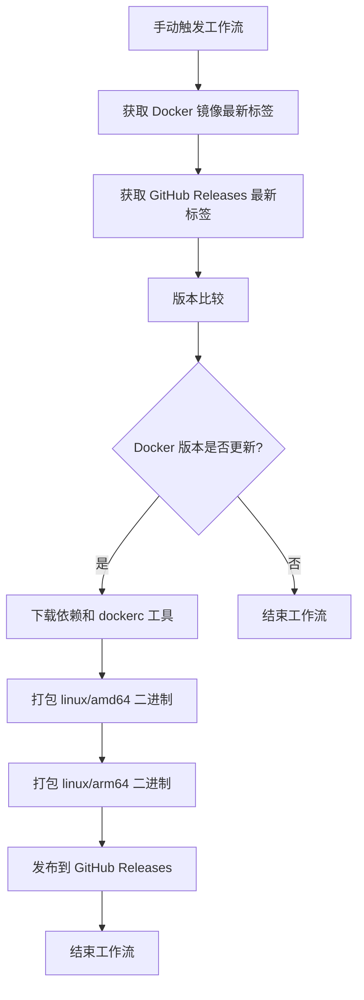

# Lobe-Chat 便携式二进制打包工具

这个 GitHub Actions 工作流用于自动将 Docker 镜像打包为便携式二进制可执行文件，并在 GitHub Releases 中发布。

## 功能概述

该工作流会自动执行以下操作：

1. **版本检查**：比较 Docker 镜像和 GitHub Releases 的版本号
2. **条件打包**：只有当 Docker 镜像版本更新时才执行打包流程
3. **多架构支持**：同时生成 `linux/amd64` 和 `linux/arm64` 两种架构的二进制文件
4. **自动发布**：将打包好的二进制文件发布到 GitHub Releases

## 工作流程

## 使用方法

### 前提条件

1. 确保 GitHub 仓库有正确的权限设置
2. 工作流需要 `contents: write` 权限来创建 Releases
3. 确保 `GITHUB_TOKEN` 有足够的权限

### 触发工作流

该工作流通过手动触发：

1. 进入 GitHub 仓库的 Actions 页面
2. 选择 "Pack & Release Portable Binary" 工作流
3. 点击 "Run workflow" 按钮
4. 点击 "Run workflow" 确认执行

### 输出文件

工作流成功执行后，会在 GitHub Releases 中生成以下文件：

- `lobe-chat-{version}-linux-amd64.bin` - 适用于 x86_64 架构的便携式二进制文件
- `lobe-chat-{version}-linux-arm64.bin` - 适用于 ARM64 架构的便携式二进制文件

## 许可证

本项目采用 MIT 许可证 - 查看 [LICENSE](LICENSE) 文件了解详情。

## 支持

如果您在使用过程中遇到问题，请：

1. 查看 [Issues](https://github.com/your-repo/issues) 页面
2. 搜索现有问题
3. 如果没有找到解决方案，请创建新的 Issue

## 相关链接

- [dockerc 工具](https://github.com/NilsIrl/dockerc) - Docker 镜像打包工具
- [Lobe-Chat 项目](https://github.com/sfun/lobe-chat) - 源 Docker 镜像项目
- [Lobe-Chat Database](https://github.com/ssfun/lobe-chat-database) - GitHub Releases 源项目
